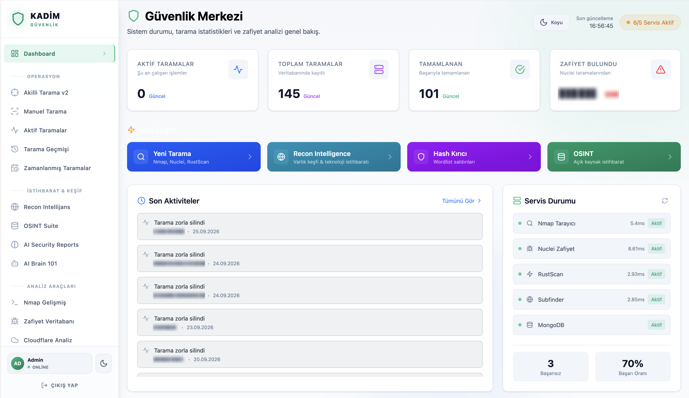
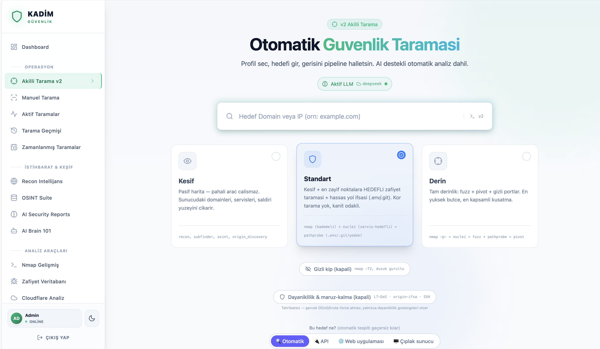
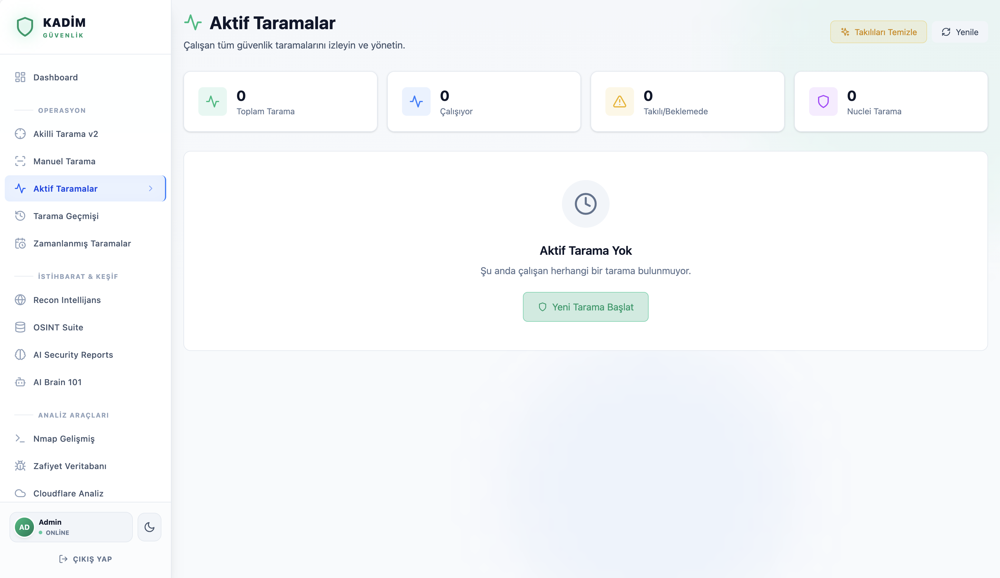
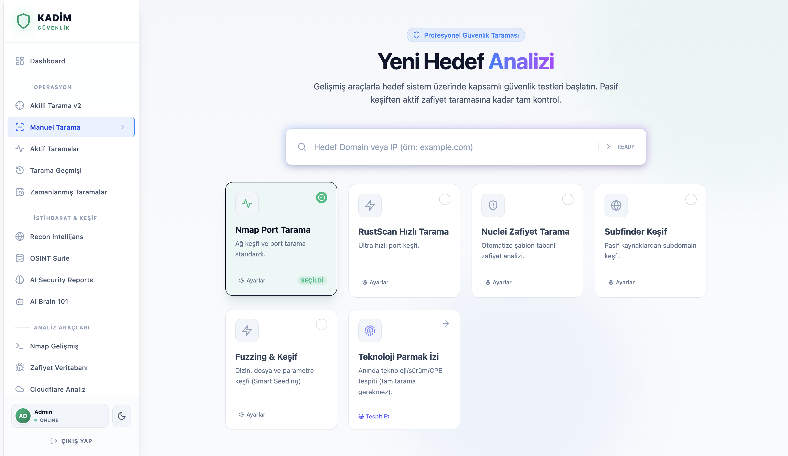
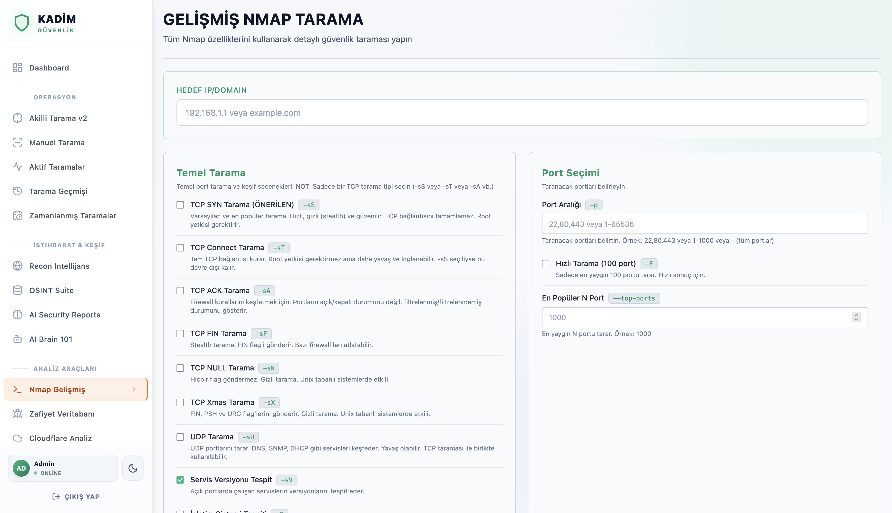

# 🛡️ Kadim Güvenlik Platformu

[](LICENSE)
[](docker-compose.yml)


**Open-source autonomous security scanning platform** — nmap, nuclei, subfinder, fuzzing & OSINT orchestrated by AI and an attack-graph engine. 15 microservices (Python / Rust / Go / React), MongoDB + Qdrant, Docker Compose.

Mikroservis mimarisinde geliştirilmiş, AI destekli, Docker tabanlı, ölçeklenebilir siber güvenlik platformu.

## ✨ Özellikler

### 🔍 Keşif & Tarama
- **Gelişmiş Nmap Tarama**: 100+ parametre ile tam kontrol, real-time verbose output
- **RustScan Hızlı Port Tarama**: Hızlı port keşfi ve servis tespiti (Rust)
- **Nuclei Zafiyet Taraması**: 5000+ template ile CVE, misconfig ve teknoloji tespiti
- **Subfinder Subdomain Keşfi**: Pasif kaynaklardan subdomain enumeration
- **Recon Intelligence**: Subdomain enumeration, teknoloji fingerprinting (50+ tech), Cloudflare bypass

### 🧠 AI Destekli Güvenlik
- **AI Brain**: Multi-AI orchestration (Gemini, Claude, DeepSeek, Ollama)
- **PHANTOM Engine** *(geliştirme aşamasında)*: APT-tarzı özerk tarama senaryosu motoru — mimari ve algoritma tasarımı tamam, motor entegrasyonu yol haritasında
- **Zero-Day Hunter** *(geliştirme aşamasında)*: Bilinmeyen zafiyet araştırma ve exploit taslağı üretimi — araştırma modülleri (`exploit_memory`, `adaptive_payloads`) hazır, uçtan uca akış geliştiriliyor
- **AI Raporlama**: Attack chain analizi, business impact değerlendirmesi
- **Security Memory**: Vektör tabanlı güvenlik hafızası ve öğrenme (Qdrant, best-effort)

### 🔐 Güvenlik Araçları
- **Hash Cracker**: Çoklu algoritma desteği (MD5, SHA, bcrypt, scrypt, Argon2...) - Rust
- **OSINT Intelligence**: Domain/IP araştırma (Shodan, VirusTotal, AbuseIPDB entegrasyonu) - Rust
- **Wi-Fi Audit**: Kablosuz ağ güvenlik analizi - Rust
- **Fuzzing Service**: Feroxbuster tabanlı dizin/endpoint fuzz, smart seeding, OSINT tabanlı wordlist
- **Stress Testing**: Yük testi ve endpoint analizi - Rust
- **Zero-Day Researcher**: Modern framework zafiyet araştırma motoru - Rust

### 🏗️ Altyapı
- **Real-time Monitoring**: WebSocket ile canlı tarama takibi
- **Log Yönetimi**: Tüm tarama logları kaydedilir ve indirilebilir
- **Modern UI**: React Router v7 + Tailwind CSS (Dark/Light mode)
- **Container-First**: Docker Compose ile kolay deployment
- **JWT Authentication**: Güvenli kullanıcı kimlik doğrulama
- **MongoDB 8.0+**: Native vector search desteği

## 🏗️ Mimari

```
┌─────────────────────────────────────────────────────────────────────────────┐
│                          Gateway (nginx:5566)                               │
└─────────────────────────────────────┬───────────────────────────────────────┘
                                      │
          ┌───────────────────────────┼───────────────────────────┐
          │                           │                           │
          ▼                           ▼                           ▼
┌─────────────────┐      ┌─────────────────────┐      ┌─────────────────┐
│ Frontend (React)│      │ Orchestrator (FastAPI)│     │ Auth (Rust)    │
└─────────────────┘      └──────────┬──────────┘      └─────────────────┘
                                    │
     ┌──────────────────────────────┼──────────────────────────────┐
     │                              │                              │
     ▼                              ▼                              ▼
┌─────────────┐  ┌─────────────────────────────────┐  ┌─────────────────┐
│ AI Service  │  │        Security Services        │  │  Data Storage   │
│ • Brain     │  │ • Nmap        • Nuclei          │  │ • MongoDB 8.0   │
│ • PHANTOM   │  │ • RustScan    • Subfinder       │  │ • Vector Search │
│ • Zero-Day  │  │ • Recon       • OSINT           │  │                 │
│ • Orchestra │  │ • Hash Cracker • Stress Test    │  │                 │
│             │  │ • Fuzzer       • Wi-Fi Audit    │  │                 │
│             │  │ • Researcher                    │  │                 │
└─────────────┘  └─────────────────────────────────┘  └─────────────────┘
```

## 🚀 Hızlı Başlangıç

### Gereksinimler
- Docker Desktop
- 8GB RAM (önerilen 16GB)
- Port 5566 açık olmalı
- (Opsiyonel) Ollama - Local AI için

### Kurulum

```bash
# Repository'yi klonlayın
git clone <repo-url>
cd kadim-guvenlik

# .env dosyasını oluşturun
cp .env.example .env

# GÜVENLİK (zorunlu):
# 1) MONGO_PASS değerini varsayılan (kadim_secure_2024) halde BIRAKMAYIN —
#    bilinen varsayılan parola ile herkes DB'nize erişir. Güçlü bir parola yazın.
# 2) JWT_SECRET tanımlı OLMALIDIR (yoksa auth çalışmaz). Rastgele üretin:
#    openssl rand -hex 32

# API anahtarlarını ayarlayın (opsiyonel ama önerilen)
# GEMINI_API_KEY - Google AI Studio'dan alın
# CLAUDE_API_KEY - Anthropic'ten alın
# SHODAN_API_KEY, VIRUSTOTAL_API_KEY, ABUSEIPDB_API_KEY - OSINT için

# Tüm servisleri başlatın
docker-compose up --build

# Detached mode (arka planda)
docker-compose up -d --build
```

### Erişim

- **Web UI**: http://localhost:5566
- **API Docs**: http://localhost:5566/api/docs
- **Gelişmiş Nmap**: http://localhost:5566/nmap-advanced
- **AI Brain**: http://localhost:5566/ai-brain

### İlk Kullanım — Kayıt & Giriş

Kayıt **varsayılan olarak AÇIK** gelir; ayrı bir ayar yapmanız gerekmez:

1. http://localhost:5566/register adresinden hesap oluşturun (kullanıcı adı + şifre)
2. Hesap otomatik aktif olur (`AUTO_ACTIVATE_USERS=true`) → hemen http://localhost:5566/login adresinden girin

Kaydı kapatmak için `.env`'e yazın ve servisleri yeniden başlatın:

```bash
REGISTER_ENABLED=false
AUTO_ACTIVATE_USERS=false   # yeni kullanıcılar admin onayı bekler (isteğe bağlı)
```
- **OSINT**: http://localhost:5566/osint

## 🖥️ Arayüz











## 📖 Kullanım

### 1. AI Brain (Akıllı Güvenlik Asistanı)

http://localhost:5566/ai-brain adresinden erişin:

- **Multi-AI Orchestra**: Gemini, Claude, DeepSeek veya Ollama ile akıllı analiz
- **Zero-Day Hunter** *(geliştirme aşamasında)*: Hedef sistemlerde bilinmeyen zafiyet arama
- **PHANTOM Scan** *(geliştirme aşamasında)*: APT-tarzı özerk güvenlik taraması
- **Security Memory**: Geçmiş taramalardan öğrenme (Qdrant vektör hafıza)

### 2. OSINT Intelligence

http://localhost:5566/osint adresinden erişin:

- Domain/IP araştırması
- DNS, WHOIS, SSL analizi
- Shodan, VirusTotal, AbuseIPDB entegrasyonu
- Graf görselleştirme

### 3. Hash Cracker

http://localhost:5566/hash-cracker adresinden erişin:

- 15+ hash algoritması desteği (MD5, SHA1/256/512, bcrypt, scrypt, Argon2, NTLM...)
- Dictionary attack (23M+ wordlist)
- Brute force attack
- Dosya şifre kırma (ZIP, PDF, Office)

### 4. Stress Testing

http://localhost:5566/stress-test adresinden erişin:

- HTTP Flood, Pulse, Chaos modları
- Smart endpoint targeting
- Real-time metrik takibi
- Rate limiting kontrolleri

### 5. Gelişmiş Nmap Tarama

http://localhost:5566/nmap-advanced adresinden erişin:

- Port aralığı, tarama tipi (SYN, TCP, UDP)
- Zamanlama (T0-T5), firewall atlatma teknikleri
- NSE scriptleri, real-time çıktı

### 6. API Kullanımı

```bash
# AI Brain - Zero-Day Hunt
curl -X POST http://localhost:5566/api/brain/zero-day-hunt \
  -H "Content-Type: application/json" \
  -H "Authorization: Bearer <token>" \
  -d '{
    "target": "https://example.com",
    "scan_depth": "medium",
    "attack_style": "ghost"
  }'

# OSINT Domain Profile
curl -X GET http://localhost:5566/api/osint/profile/example.com \
  -H "Authorization: Bearer <token>"

# Hash Cracking
curl -X POST http://localhost:5566/api/hash/crack \
  -H "Content-Type: application/json" \
  -d '{
    "hash": "5f4dcc3b5aa765d61d8327deb882cf99",
    "algorithm": "md5",
    "attack_mode": "dictionary"
  }'

# Nmap + Nuclei Combined Scan
curl -X POST http://localhost:5566/api/scan \
  -H "Content-Type: application/json" \
  -d '{
    "target": "example.com",
    "scan_types": ["nmap", "nuclei"],
    "nmap_options": {"-sV": true, "-T4": true},
    "nuclei_options": {"severity": ["critical", "high"]}
  }'
```

## 🔧 Proje Yapısı

```
kadim-guvenlik/
├── frontend/                    # React UI (Vite + React Router v7)
│   └── app/
│       ├── routes/              # Sayfa bileşenleri (auto-scan, ai-brain, hash-cracker, ...)
│       ├── hooks/               # usePipelineStream (canlı WS akışı) vb.
│       └── components/          # Paylaşılan bileşenler
├── orchestrator/                # FastAPI merkezi kontrol
│   ├── main.py                  # Ana API router + REST (/scan, /v2/scan)
│   ├── core/                    # db (Mongo singleton), config, scoring, auth_middleware
│   ├── integrations/            # Servis proxy'leri (ai, brain, fuzz, recon, ...) + ayarlar
│   ├── pipeline/                # Otonom tarama beyni
│   │   ├── attack_graph.py      # Saldırı grafiği + siege_score önceliklendirme
│   │   ├── autonomous_engine.py # Karar döngüsü (DECIDE → ACT → OBSERVE)
│   │   ├── adaptive_scanner.py  # Öğrenen imza/teknoloji eşleme
│   │   └── memory_store.py      # Vektör hafıza (Qdrant, best-effort)
│   └── routers/                 # Ek endpoint'ler (nmap, nuclei, reports, ...)
├── services/
│   ├── ai-service/              # 🧠 AI Brain (Python)
│   │   ├── main.py              # Ana AI servisi
│   │   ├── brain_router.py      # Brain API endpoints
│   │   ├── ai_orchestra.py      # Multi-AI orchestration
│   │   ├── threat_intel_engine.py # Tehdit istihbaratı
│   │   ├── report_engine.py     # Rapor/analiz motoru
│   │   └── agents/              # orchestrator / recon / vuln_scanner ajanları
│   ├── auth-service/            # 🔐 JWT Auth (Rust)
│   ├── hash-cracker/            # 🔑 Hash Cracker (Rust)
│   ├── osint-service/           # 🌐 OSINT Intelligence (Rust)
│   ├── stress-service/          # ⚡ Stress / yük testi (Rust)
│   ├── researcher-service/      # 🔬 Zero-Day Researcher (Rust)
│   ├── fuzz-service-rs/         # 🎯 Fuzzing (Rust + Feroxbuster)
│   ├── crawler-service/         # 🕷️ Headless (JS-render) crawler
│   ├── fingerprint-service/     # 🆔 Teknoloji parmak izi (Go / wappalyzergo)
│   ├── recon-service/           # 📡 Recon Intelligence (Rust)
│   ├── nmap-service/            # 🔍 Nmap (Python)
│   ├── rustscan-service/        # ⚡ RustScan (Python)
│   ├── nuclei-service/          # 🛡️ Nuclei (Python)
│   ├── subfinder-service/       # 📍 Subfinder (Python)
│   └── wifi-service/            # 📶 Wi-Fi Audit (Rust)
├── nginx/                       # Reverse proxy config
└── docker-compose.yml           # Servis orkestrasyonu
```

## 🔒 Güvenlik

- ✅ Input validation (command injection önleme)
- ✅ JWT tabanlı kimlik doğrulama
- ✅ Docker network isolation
- ✅ Minimal container privileges (cap_add sadece gerekli yetkiler)
- ✅ Environment variables ile secret yönetimi
- ✅ Rate limiting
- ✅ HTTPS support (production için nginx SSL config)

## 🔌 External API Entegrasyonları

| Servis | Kullanım | API Key Gerekli |
|--------|----------|-----------------|
| **Google Gemini** | AI analiz, PHANTOM | Evet |
| **Anthropic Claude** | AI analiz | Evet |
| **Ollama** | Local AI | Hayır |
| **Shodan** | OSINT - host keşif | Evet |
| **VirusTotal** | OSINT - threat intel | Evet |
| **AbuseIPDB** | OSINT - IP reputation | Evet |

## 📊 Container Yönetimi

```bash
# Logları görüntüle
docker-compose logs -f orchestrator
docker-compose logs -f ai-service

# Belirli servisi yeniden başlat
docker-compose restart ai-service

# Tüm servisleri durdur
docker-compose down

# Volume'ları da sil (temiz başlangıç)
docker-compose down -v
```

## 🛠️ Troubleshooting

### Port 5566 kullanımda
```bash
lsof -i :5566
# İlgili process'i durdur veya docker-compose.yml'de portu değiştir
```

### AI servisi çalışmıyor
```bash
# Ollama kurulu mu kontrol et
curl http://localhost:11434/api/tags

# Gemini API key doğru mu
docker-compose logs ai-service | grep -i "gemini\|error"
```

### MongoDB bağlantı hatası
```bash
docker-compose logs mongodb
docker-compose restart mongodb
```

## 🎯 Roadmap

### Tamamlanan ✅
- [x] Core tarama servisleri (Nmap, RustScan, Nuclei, Subfinder)
- [x] AI Brain & Multi-AI Orchestra
- [x] Hash Cracker (Rust, high-performance)
- [x] OSINT Intelligence (Shodan, VT, AbuseIPDB)
- [x] Stress Testing / yük testi
- [x] JWT Authentication
- [x] Real-time WebSocket monitoring
- [x] MongoDB vector search integration
- [x] Otonom tarama motoru (attack-graph + siege skorlama)
- [x] Security Memory (Qdrant vektör hafıza, best-effort)

### Geliştirme aşamasında 🔧
- [ ] PHANTOM APT-style scanning — algoritma tasarımı tamam, motor entegrasyonu sürüyor
- [ ] Zero-Day Hunter — araştırma modülleri hazır, uçtan uca akış geliştiriliyor

### Planlanan 📋
- [ ] PDF rapor export
- [ ] Zamanlanmış taramalar (cron job)
- [ ] Email/Slack bildirimleri
- [ ] Multi-tenant support
- [ ] Custom Nuclei template yönetimi
- [ ] Kubernetes deployment
- [ ] Prometheus/Grafana monitoring

## 🤝 Katkıda Bulunma

Katkılar memnuniyetle karşılanır — yeni araç servisi, prob modülü, hata düzeltmesi, dokümantasyon.

1. Fork edin
2. Feature branch oluşturun (`git checkout -b feature/yeni-ozellik`)
3. Commit edin (`git commit -m 'feat: yeni özellik eklendi'`)
4. Push edin (`git push origin feature/yeni-ozellik`)
5. Pull Request açın

Ayrıntılar: [CONTRIBUTING.md](CONTRIBUTING.md) · Hata/özellik bildirimi: [Issue şablonları](.github/ISSUE_TEMPLATE/) · Güvenlik açığı: [SECURITY.md](SECURITY.md)

## 📄 Lisans

MIT License

## 👥 Ekip

Kadim Güvenlik Platformu - AI destekli, mikroservis tabanlı siber güvenlik çözümü

---

> ⚠️ **Sorumluluk Reddi / Disclaimer**
>
> Bu platform yalnızca **kendi sisteminizde veya yazılı izniniz olan hedeflerde** yetkili güvenlik testleri için tasarlanmıştır. İzinsiz sistemleri taramak yasadışıdır (TCK 243-244 ve ilgili düzenlemeler).
>
> Bu yazılım **kullanıcının sorumluluğundadır**. Araçla yapılan her işlem ve doğabilecek her sonuç — sistem hasarı, veri kaybı, hizmet kesintisi, hukuki/idari yaptırım dahil ancak bunlarla sınırlı olmamak üzere — **tamamen kullanıcıya aittir**. Geliştiriciler ve katkıda bulunanlar hiçbir koşulda, hiçbir iddia veya zarardan dolayı sorumlu tutulamaz. Yazılımı kullanarak bu koşulları kabul etmiş sayılırsınız.
>
> *Use at your own risk. This software is provided "as is" for authorized security testing only. The authors and contributors are **not responsible** for any damage, data loss, service disruption, or legal consequences arising from the use or misuse of this software. By using it, you accept full responsibility.*
